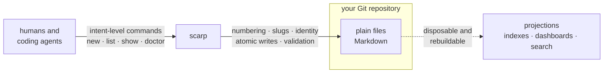
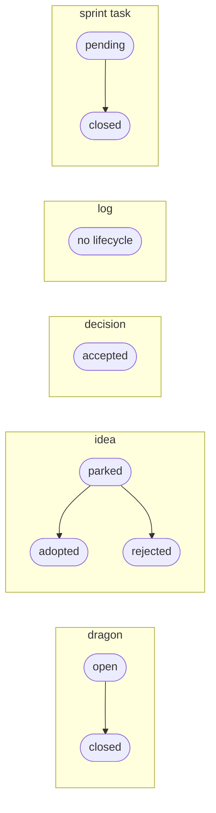

<div align="center">
  <picture>
    <source media="(prefers-color-scheme: dark)" srcset="https://raw.githubusercontent.com/henry-filgueiras/scarp/HEAD/assets/logo-dark.svg">
    
  </picture>

  <p><strong>Git-native, reviewable project archaeology.</strong></p>

  <p><em>Scarp exposes the strata of a repository: what changed, why, and what remains unsettled.</em></p>

  <p><sub>Dual-licensed <strong>MIT OR Apache-2.0</strong> · requires Rust 1.88+</sub></p>
</div>

---

Every project accumulates knowledge that never makes it into the code: why an
unusual design exists, which risks are known but unresolved, which tradeoffs
were settled and on what evidence. Most of it evaporates — into closed tabs,
stale chat threads, and the heads of people who leave.

Scarp keeps that knowledge **in the repository, as ordinary files**, and gives
whoever is editing them — a person or a coding agent — intent-level commands
for maintaining it:

- **decisions** — settled tradeoffs, with their reasoning preserved
- **dragons** — known unresolved risks, kept visible until slain
- **ideas** — uncommitted proposals, parked until adopted or rejected
- **logs** — durable discoveries that would otherwise be re-researched
- **sprints** — scoped slices of work and their outcomes

The filesystem is canonical. Git provides history. Scarp supplies numbering,
identity, validation, and machine-readable projections — nothing you can't
read or edit with a text editor.

## See it work

Recording a known risk, listing it, and closing it once it is handled — every
line below is real output from the
[quickstart](https://github.com/henry-filgueiras/scarp#quickstart), which you can run
yourself in a throwaway directory in about a minute:

```console
$ scarp new dragon "Sequence collisions on concurrent branches"
created dragon:1 at archaeology/dragons/0001-sequence-collisions-on-concurrent-branches.md

$ scarp list dragons
dragon:1  open  Sequence collisions on concurrent branches  (archaeology/dragons/0001-sequence-collisions-on-concurrent-branches.md)

$ scarp close dragon:1
closed dragon:1 (open -> closed) at archaeology/dragons/0001-sequence-collisions-on-concurrent-branches.md
```

Automation gets the same facts without parsing prose — and without `jq`:

```console
$ scarp list dragons --json
[{"id":"drg_01KYK9KQ4PTGXP34KBPKRBDXC1","sequence":1,"kind":"dragon","status":"closed","title":"Sequence collisions on concurrent branches","created":"2026-07-27","path":"archaeology/dragons/0001-sequence-collisions-on-concurrent-branches.md"}]
```

One deterministic line on stdout, byte-stable across runs and therefore
diffable — the stable `id` is what a caller should key on, not the display
sequence.

> **Why "dragons"?** Old maps marked unexplored territory *hic sunt dracones* —
> here be dragons. A dragon is a known risk nobody has resolved yet. Keeping it
> as a first-class, listable artifact means it stays on the map instead of in
> someone's memory.

This repository is Scarp's own first user. Its decisions, dragons, sprints, and
work items live in
[`archaeology/`](https://github.com/henry-filgueiras/scarp/tree/HEAD/archaeology)
as ordinary committed files, reviewed in the same pull requests as the code
they explain — and `scripts/check.sh` runs `scarp doctor` over that whole
corpus before every commit, so the tool is gated on its own archaeology
staying valid.

## Install

Scarp is a single binary with no runtime dependencies. Building it needs Rust
1.88 or newer.

```sh
cargo install scarp --locked
```

This compiles Scarp and its dependencies and places the `scarp` binary in
Cargo's install root — `~/.cargo/bin` unless you have configured otherwise.
`--locked` builds against the dependency versions the release was tested with.

Compiling the dependency tree dominates the wait, and how long it takes depends
on your machine and your cargo cache. Building the released sources with an
empty cache on an 18-core laptop took about 4.5 seconds of wall clock — but
roughly 43 seconds of CPU, spread across those cores, so a machine with fewer
of them takes proportionally longer, and fetching the registry index for the
first time adds to it. The quickstart below is separate from that, and is
near-instant on any machine.

## Quickstart

This creates a throwaway directory, turns it into a Scarp repository, records
two artifacts, closes one, and validates the result — then deletes the
directory it created, and nothing else. Reading it takes about a minute;
running it is near-instant.

It needs a Unix-like shell — `zsh`, `bash`, or any POSIX `sh` — and the
standard `mktemp` and `rm` utilities. It needs no Git repository, and no
optional helper: `jq` in particular is **not** required.

```sh
(
  set -eu
  scarp_demo_dir="$(mktemp -d "${TMPDIR:-/tmp}/scarp-demo.XXXXXX")"
  case $scarp_demo_dir in /*) ;; *) scarp_demo_dir="$PWD/$scarp_demo_dir" ;; esac
  trap 'command rm -rf "$scarp_demo_dir"' EXIT
  cd "$scarp_demo_dir"

  scarp init
  scarp new dragon "Sequence collisions on concurrent branches"
  scarp new decision "Keep canonical records as ordinary files"
  scarp list dragons
  scarp show dragon:1
  scarp close dragon:1
  scarp list dragons --json
  scarp doctor
)
```

Every part of that wrapper earns its place, because pasting a demo into a shell
you care about should be safe:

- The whole block is **one subshell**, so `set -eu`, the `cd`, and
  `$scarp_demo_dir` all disappear with it. Your shell's options and working
  directory are exactly as you left them.
- `mktemp -d` creates a directory that did not exist a moment ago. There is no
  fixed path to collide with a stale run, another user on the same host, or a
  symlink someone planted.
- The `case` line makes that path **absolute before the `cd`**. A relative
  `TMPDIR` — `TMPDIR=tmp` is enough — makes `mktemp` hand back a relative path,
  which after the `cd` would name a different place than it did before it.
- The **trap is installed only after that directory exists**, and deletes
  exactly the path `mktemp` returned, whether the block runs to the end or a
  command inside it fails. Nothing here recursively deletes a path spelled out
  in advance.
- `set -e` means that if setup fails, the subshell exits **before the first
  `scarp` command**. Scarp never runs in the directory you were standing in.

One limit, stated rather than papered over: if you interrupt the block with
`Ctrl-C`, whether the `EXIT` trap still runs is your shell's choice, not
Scarp's. Measured in real terminals on macOS: `bash` and `/bin/sh` run it,
while `zsh` and `dash` terminate without it and leave the temporary directory
behind. That is the whole cost — the directory is one `mktemp` made, nothing
outside it is ever touched, and `scarp init` printed its path on the first
line if you want to remove it yourself.

What you should see — this is real output, unedited:

```console
$ scarp init
initialized Scarp repository at `/private/var/folders/pz/6_cybl0j4xq1c9475p1rbv980000gn/T/scarp-demo.bBoxoB`
  created archaeology
  created archaeology/dragons
  created archaeology/.gitattributes
  created .scarp.toml

$ scarp new dragon "Sequence collisions on concurrent branches"
created dragon:1 at archaeology/dragons/0001-sequence-collisions-on-concurrent-branches.md

$ scarp new decision "Keep canonical records as ordinary files"
created decision:1 at archaeology/decisions/0001-keep-canonical-records-as-ordinary-files.md

$ scarp list dragons
dragon:1  open  Sequence collisions on concurrent branches  (archaeology/dragons/0001-sequence-collisions-on-concurrent-branches.md)

$ scarp show dragon:1
---
id: drg_01KYK9KQ4PTGXP34KBPKRBDXC1
sequence: 1
kind: dragon
status: open
created: 2026-07-27
---

# Sequence collisions on concurrent branches

## Context

## Question

## Constraints

## Candidate direction

## Resolution criteria

$ scarp close dragon:1
closed dragon:1 (open -> closed) at archaeology/dragons/0001-sequence-collisions-on-concurrent-branches.md

$ scarp list dragons --json
[{"id":"drg_01KYK9KQ4PTGXP34KBPKRBDXC1","sequence":1,"kind":"dragon","status":"closed","title":"Sequence collisions on concurrent branches","created":"2026-07-27","path":"archaeology/dragons/0001-sequence-collisions-on-concurrent-branches.md"}]

$ scarp doctor
doctor: 2 artifact(s) checked, no problems found
```

Three things differ on your machine. The **temporary path** is whatever
`mktemp` just made up, and it varies in full rather than in a prefix — macOS
puts it under `/private/var/folders/…`, most Linux systems under `/tmp/…`. The
**stable id** is a freshly generated ULID. And **`created`** is today's date.

`scarp init` creates `.scarp.toml`, `archaeology/`, `archaeology/dragons/`, and
`archaeology/.gitattributes` inside that temporary directory. Each `scarp new`
adds one Markdown file, and `scarp close` rewrites a single line of front matter
in place. Nothing outside the temporary directory is written, and the trap
removes that directory when the block ends — there is no cleanup step to
remember, and no fixed path for one to get wrong.

The `scarp show` output above is not a rendering. It is the literal content of
`archaeology/dragons/0001-sequence-collisions-on-concurrent-branches.md`, front
matter and all — which is the point: these are ordinary Markdown files, and
Scarp is not required to read, edit, review, or merge them. To keep them and
open them yourself, delete the `trap` line before running the block; the
directory then survives, and `scarp init` prints its path on the first line.

The `--json` line answers the same question the human-readable `scarp list
dragons` answered, in the form automation wants: one deterministic array on
stdout, with no prose to parse and no `jq` needed to read it. `new`, `list`,
`show`, `doctor`, and `resolve` each take `--json`, and each shares its
implementation with the human-readable path, so the two views cannot drift
apart.

## How it fits



The arrows only point one way for a reason:

- **Files are canonical.** No database, hidden state, or remote service is
  required to understand or modify a Scarp repository.
- **Scarp never holds a repository hostage.** The records stay readable *and
  directly editable* without the executable — they are ordinary Markdown, and
  editing one by hand is a supported write path, not a corruption.
- **Display numbers are not identity.** `0003-…` prefixes exist for humans;
  each artifact also carries a stable ULID, so an artifact's identity survives
  renumbering, moves, and merges. Two branches can still pick the same display
  number for different artifacts — see the dragons below.
- **Payload format is not the artifact model.** Identity, collection, and
  lifecycle are independent of whether a body is Markdown, JSON, or JSONL. Only
  Markdown artifacts ship today; the rest is a boundary the core leaves room
  for, not a feature you can use.
- **One core, two interfaces.** Human-readable output by default,
  deterministic `--json` for automation — same semantics, no parallel logic.
- **Projections are disposable.** Any future index or dashboard must be
  rebuildable from the files and must never become the only home of a fact.
- **Git is optional at the core.** History and provenance features may use it;
  basic operation doesn't require it.

### What "safe" means here, and where the dragons are

Scarp's write contract is scoped by failure class, and its limits are recorded
as dragons in its own archaeology rather than left as fine print:

- **Returned errors.** A failed operation leaves exactly one valid artifact,
  unchanged wherever that is possible; a multi-step mutation rolls back what it
  had already done. Existing files are never truncated or overwritten in place.
- **Abrupt termination** — kill, panic, OOM. Every individual step is a single
  atomic rename, so a path holds either the old contents or the new ones, never
  a half-written file. A mutation interrupted between steps is diagnosable by
  `scarp doctor` rather than by guesswork.
- **Power loss and kernel crashes** — **out of scope.** Nothing is fsynced, so
  an unclean shutdown can still tear a write that every in-process guarantee
  covered. This is a deliberate, recorded exclusion, not an oversight; whether
  it ever changes is an open dragon.

Concurrency is the other honest gap. Two branches can independently allocate
the same display sequence, and reconciling the duplicates after a merge is a
manual job today — stable ULIDs keep the artifacts distinct and nothing is
overwritten, but Scarp does **not** claim to be safe for concurrent writers,
and there is no locking. That dragon is open too.

Both are listed in [`archaeology/dragons/`](https://github.com/henry-filgueiras/scarp/tree/HEAD/archaeology/dragons),
which is the argument for the tool in miniature: the risks a project knows
about should be findable by strangers, not just by the person who found them.

## Artifact lifecycles

Lifecycle state lives in front matter, and transitions rewrite it in place:
a state change is a one-line diff, never a file move, so canonical paths
stay stable across an artifact's whole life. A closure may carry the
narrative it owes — `--body-file` writes the collection's terminal section
in the same atomic write as the transition, so the state and the story
land together or not at all. Legal `[[kind:N]]` sugar in that narrative is
bound to `[[stable-id|label]]` at authorship time, so nobody hand-copies a
ULID to cite an artifact. A bare `[[idea:30]]` takes the target's full
title as its frozen label; write `[[idea:30|idea 30]]` when you want
shorter prose, and your label is kept. Lifecycle directories are not
part of managed collection semantics. Terminal states are transitions,
never deletions: history is the product.



```text
archaeology/
├── decisions/          settled tradeoffs and their evidence
├── dragons/            known risks, open and closed
├── ideas/              proposals: parked, adopted, or rejected
├── logs/               durable discoveries, stateless and free-form
└── sprints/
    └── 0001-bootstrap/
        ├── sprint.md
        └── 0001-task.md ...
```

Stable containment is collection-specific (decision 11 as amended):
dragons, ideas, and logs file directly in their collection directories, while
each sprint owns a stable containment directory and its tasks live inside
it. Containment never changes over an artifact's lifecycle — state is
carried only in front matter.

## Status

Scarp is bootstrapping its smallest useful vertical slice. Honest scoreboard:

| Command | What it does | Status |
| --- | --- | --- |
| `scarp init` | initialize a repository | ✅ |
| `scarp new dragon "…" [--body-file PATH] [--json]` | create an artifact; Scarp picks the sequence, slug, and stable ULID, and fills the template's sections from `--body-file` when given | ✅ |
| `scarp list dragons [--json]` | discover and list a collection | ✅ |
| `scarp show dragon:N [--json]` | inspect one artifact | ✅ |
| `scarp doctor [--json]` | validate repository invariants, report every finding | ✅ |
| `scarp close dragon:N [--resolved-by …] [--body-file PATH]` | close a dragon, sprint, or task; optionally record what resolved it, and the closure's terminal narrative — its `Result`, `Resolution`, or `Retrospective` — in the same write | ✅ |
| `scarp reopen dragon:N` | return a closed dragon to `open` | ✅ |
| `scarp adopt idea:N [--adopted-by …]` / `scarp reject idea:N` | move a parked idea to a terminal state | ✅ |
| `scarp resolve idea:15 … [--json]` | resolve references to stable ids, one per line, in input order | ✅ |
| `scarp fortune` | resurface one open dragon or parked idea, favoring stale artifacts | ✅ |
| `scarp proposal list` / `realize N` / `reconcile N` | realize a GitHub issue as a canonical idea, from your machine, then close the issue citing it ([how and why](https://github.com/henry-filgueiras/scarp/blob/HEAD/docs/remote-proposals.md)) | ✅ |
| `scarp completions <shell>` | emit a completion script for bash, zsh, fish, elvish, or powershell | ✅ |

Dragons, ideas, decisions, logs, sprints, and tasks are managed collections:
`new`, `list`, and `show` cover all six, and the rows above show the dragon
spelling. Lifecycle verbs are collection-specific rather than universal —
`close` applies to dragons, sprints, and tasks, `reopen` to dragons, `adopt`
and `reject` to ideas. Decisions are permanent records with no lifecycle verbs
at all: a changed position is a new decision that supersedes the old one. Logs
have no lifecycle either, and no template: a log records something that
already happened, so `--body-file` writes its prose verbatim beneath the
title and its `--json` projection carries no `status` key.

What is *not* here matters as much. There is no automatic capture from your
editor or agent session, no context injection, no search, no index, and no
coordination between concurrent writers — records are written deliberately, by
you or by an agent running these commands, and Scarp's job is to enforce
structure, identity, and validity. JSON and JSONL artifact payloads are an
architectural boundary, not a shipped feature: `--json` is an *output* format,
while every artifact Scarp creates today is Markdown. Daemons, indexes,
embeddings, semantic search, MCP, GraphQL, and dashboards are deliberately
deferred — each would need a recorded decision and evidence that the layer
beneath it is useful.

## Development

From a checkout of the repository — the published crate carries `src/` and
`tests/` but not the contributor scripts:

```sh
cargo build
cargo test
cargo run -- --help
scripts/check.sh   # format, lint, test, doctor
```

### Shell completions

`scarp completions <shell>` emits a completion script for `bash`,
`zsh`, `fish`, `elvish`, or `powershell`. For zsh:

```sh
mkdir -p ~/.zfunc
scarp completions zsh > ~/.zfunc/_scarp
# in ~/.zshrc, before compinit:
#   fpath=(~/.zfunc $fpath)
```

Scarp is also a case study in human–AI collaboration on long-lived projects.
[`CLAUDE.md`](https://github.com/henry-filgueiras/scarp/blob/HEAD/CLAUDE.md)
holds the project invariants and agent workflow, and
[`archaeology/`](https://github.com/henry-filgueiras/scarp/tree/HEAD/archaeology)
is the living record — the decisions, dragons, and sprints behind every change
in this repository. Neither is part of the published crate; both links point at
the repository.

## License

Licensed under either of

- Apache License, Version 2.0 ([LICENSE-APACHE](LICENSE-APACHE) or
  <https://www.apache.org/licenses/LICENSE-2.0>)
- MIT license ([LICENSE-MIT](LICENSE-MIT) or
  <https://opensource.org/licenses/MIT>)

at your option — the Rust ecosystem convention, and the same terms rustc,
serde, and clap ship under. The crate manifest declares `MIT OR Apache-2.0`,
and both license texts travel inside the published `.crate`.

GitHub's sidebar shows only "Apache License 2.0". That is its license detector
picking one file out of two, not a statement about the grant; it reports the
same single license for rustc, serde, and clap, which are dual-licensed in
exactly this way. Either license, at your option, is the actual offer.

Unless you explicitly state otherwise, any contribution intentionally
submitted for inclusion in the work by you, as defined in the Apache-2.0
license, shall be dual licensed as above, without any additional terms or
conditions.
