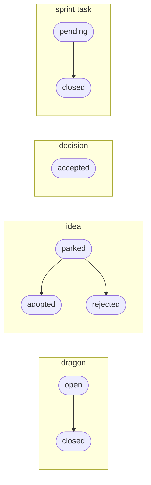

<div align="center">
  <picture>
    <source media="(prefers-color-scheme: dark)" srcset="https://raw.githubusercontent.com/henry-filgueiras/scarp/HEAD/assets/logo-dark.svg">
    
  </picture>

  <p><strong>Git-native project archaeology and structured repository memory<br>for humans and coding agents.</strong></p>

  <p><em>Scarp exposes the strata of a repository: what changed, why, and what remains unsettled.</em></p>
</div>

---

Every project accumulates knowledge that never makes it into the code: why an
unusual design exists, which risks are known but unresolved, which tradeoffs
were settled and on what evidence. Most of it evaporates — into closed tabs,
stale chat threads, and the heads of people who leave.

Scarp keeps that knowledge **in the repository, as ordinary files**, and gives
humans and coding agents safe, intent-level commands for maintaining it:

- **decisions** — settled tradeoffs, with their reasoning preserved
- **dragons** — known unresolved risks, kept visible until slain
- **ideas** — uncommitted proposals, parked until adopted or rejected
- **logs** — durable discoveries that would otherwise be re-researched
- **sprints** — scoped slices of work and their outcomes

The filesystem is canonical. Git provides history. Scarp supplies numbering,
identity, validation, and machine-readable projections — nothing you can't
read or edit with a text editor.

## See it work

This repository is Scarp's first user: its own risks, decisions, and work
items are tracked with the tool. The output below is real.

```console
$ scarp list dragons
dragon:1  open  Branch sequence collisions  (archaeology/dragons/0001-branch-sequence-collisions.md)
dragon:2  open  Repository validity is not closed under Git round-trip  (archaeology/dragons/0002-repository-validity-not-closed-under-git-round-trip.md)
dragon:3  open  Reference marker syntax and typed edge vocabulary  (archaeology/dragons/0003-reference-marker-syntax-and-typed-edge-vocabulary.md)

$ scarp show dragon:3
---
id: drg_01KY169X7W0YXJ5QFV4D1MK4FB
sequence: 3
kind: dragon
status: open
created: 2026-07-20
---

# Reference marker syntax and typed edge vocabulary

## Context

Decision 0006 (`dec-bootstrap-reference-model`) settled reference
semantics — stable-ID targets with frozen labels, write-time binding, …
```

Automation gets the same facts without parsing prose:

```console
$ scarp list dragons --json | jq '.[-1]'
{
  "id": "drg_01KY169X7W0YXJ5QFV4D1MK4FB",
  "sequence": 3,
  "kind": "dragon",
  "status": "open",
  "title": "Reference marker syntax and typed edge vocabulary",
  "created": "2026-07-20",
  "path": "archaeology/dragons/0003-reference-marker-syntax-and-typed-edge-vocabulary.md"
}
```

> **Why "dragons"?** Old maps marked unexplored territory *hic sunt dracones* —
> here be dragons. A dragon is a known risk nobody has resolved yet. Keeping it
> as a first-class, listable artifact means it stays on the map instead of in
> someone's memory.

## Install

Scarp is a single binary with no runtime dependencies. Building it needs Rust
1.88 or newer.

```sh
cargo install scarp --locked
```

This compiles Scarp and its dependencies and places the `scarp` binary in
Cargo's install root — `~/.cargo/bin` unless you have configured otherwise.
`--locked` builds against the dependency versions the release was tested with.

Compiling the dependency tree dominates the wait, and how long it takes depends
on your machine and cargo cache — measured cold on an 18-core laptop it was
under ten seconds, but a smaller machine will take considerably longer. The
quickstart below is separate from that, and near-instant.

## Quickstart

This creates a throwaway directory, turns it into a Scarp repository, records
two artifacts, closes one, and validates the result — then deletes the
directory it created, and nothing else. Reading it takes about a minute;
running it is near-instant.

It needs a Unix-like shell — `zsh`, `bash`, or any POSIX `sh` — and the
standard `mktemp` and `rm` utilities. It needs no Git repository, and no
optional helper: `jq` in particular is **not** required.

```sh
(
  set -eu
  scarp_demo_dir="$(mktemp -d "${TMPDIR:-/tmp}/scarp-demo.XXXXXX")"
  trap 'command rm -rf "$scarp_demo_dir"' EXIT
  cd "$scarp_demo_dir"

  scarp init
  scarp new dragon "Sequence collisions on concurrent branches"
  scarp new decision "Keep canonical records as ordinary files"
  scarp list dragons
  scarp show dragon:1
  scarp close dragon:1
  scarp doctor
)
```

Every part of that wrapper earns its place, because pasting a demo into a shell
you care about should be safe:

- The whole block is **one subshell**, so `set -eu`, the `cd`, and
  `$scarp_demo_dir` all disappear with it. Your shell's options and working
  directory are exactly as you left them.
- `mktemp -d` creates a directory that did not exist a moment ago. There is no
  fixed path to collide with a stale run, another user on the same host, or a
  symlink someone planted.
- The **trap is installed only after that directory exists**, and deletes
  exactly the path `mktemp` returned — on success, on failure, and on `Ctrl-C`
  alike. Nothing here recursively deletes a path spelled out in advance.
- `set -e` means that if setup fails, the subshell exits **before the first
  `scarp` command**. Scarp never runs in the directory you were standing in.

What you should see — this is real output, unedited:

```console
$ scarp init
initialized Scarp repository at `/private/var/folders/pz/6_cybl0j4xq1c9475p1rbv980000gn/T/scarp-demo.I9YldH`
  created archaeology
  created archaeology/dragons
  created archaeology/.gitattributes
  created .scarp.toml

$ scarp new dragon "Sequence collisions on concurrent branches"
created dragon:1 at archaeology/dragons/0001-sequence-collisions-on-concurrent-branches.md

$ scarp new decision "Keep canonical records as ordinary files"
created decision:1 at archaeology/decisions/0001-keep-canonical-records-as-ordinary-files.md

$ scarp list dragons
dragon:1  open  Sequence collisions on concurrent branches  (archaeology/dragons/0001-sequence-collisions-on-concurrent-branches.md)

$ scarp show dragon:1
---
id: drg_01KYK6JYJYB0VS3BES869P7ZAR
sequence: 1
kind: dragon
status: open
created: 2026-07-27
---

# Sequence collisions on concurrent branches

## Context

## Question

## Constraints

## Candidate direction

## Resolution criteria

$ scarp close dragon:1
closed dragon:1 (open -> closed) at archaeology/dragons/0001-sequence-collisions-on-concurrent-branches.md

$ scarp doctor
doctor: 2 artifact(s) checked, no problems found
```

Three things differ on your machine. The **temporary path** is whatever
`mktemp` just made up, and it varies in full rather than in a prefix — macOS
puts it under `/private/var/folders/…`, most Linux systems under `/tmp/…`. The
**stable id** is a freshly generated ULID. And **`created`** is today's date.

`scarp init` creates `.scarp.toml`, `archaeology/`, `archaeology/dragons/`, and
`archaeology/.gitattributes` inside that temporary directory. Each `scarp new`
adds one Markdown file, and `scarp close` rewrites a single line of front matter
in place. Nothing outside the temporary directory is written, and the trap
removes that directory when the block ends — there is no cleanup step to
remember, and no fixed path for one to get wrong.

The `scarp show` output above is not a rendering. It is the literal content of
`archaeology/dragons/0001-sequence-collisions-on-concurrent-branches.md`, front
matter and all — which is the point: these are ordinary Markdown files, and
Scarp is not required to read, edit, review, or merge them. To keep them and
open them yourself, delete the `trap` line before running the block; the
directory then survives, and `scarp init` prints its path on the first line.

## How it fits


The arrows only point one way for a reason:

- **Files are canonical.** No database, hidden state, or remote service is
  required to understand or modify a Scarp repository.
- **Scarp never holds a repository hostage.** Everything stays readable and
  editable without the executable — it's just Markdown, JSON, and JSONL.
- **Display numbers are not identity.** `0003-…` prefixes exist for humans;
  each artifact also carries a stable ID (a ULID), so concurrent branches can
  collide on sequence numbers without corrupting anything.
- **One core, two interfaces.** Human-readable output by default,
  deterministic `--json` for automation — same semantics, no parallel logic.
- **Projections are disposable.** Any future index or dashboard must be
  rebuildable from the files and must never become the only home of a fact.
- **Git is optional at the core.** History and provenance features may use it;
  basic operation doesn't require it.

## Artifact lifecycles

Lifecycle state lives in front matter, and transitions rewrite it in place:
a state change is a one-line diff, never a file move, so canonical paths
stay stable across an artifact's whole life. Lifecycle directories are not
part of managed collection semantics. Terminal states are transitions,
never deletions: history is the product.



```text
archaeology/
├── decisions/          settled tradeoffs and their evidence
├── dragons/            known risks, open and resolved
├── ideas/              proposals: parked, adopted, or rejected
├── logs/               durable discoveries
└── sprints/
    └── 0001-bootstrap/
        ├── sprint.md
        └── 0001-task.md ...
```

Stable containment is collection-specific (decision 11 as amended):
dragons and ideas file directly in their collection directories, while
each sprint owns a stable containment directory and its tasks live inside
it. Containment never changes over an artifact's lifecycle — state is
carried only in front matter.

## Status

Scarp is bootstrapping its smallest useful vertical slice. Honest scoreboard:

| Command | What it does | Status |
| --- | --- | --- |
| `scarp init` | initialize a repository | ✅ |
| `scarp new dragon "…"` | create an artifact; sequence, slug, and ID assigned safely | ✅ |
| `scarp list dragons [--json]` | discover and list artifacts | ✅ |
| `scarp show dragon:N` | inspect one artifact | ✅ |
| `scarp doctor [--json]` | validate repository invariants, report every finding | ✅ |
| `scarp close dragon:N` / `scarp reopen dragon:N` | transition an artifact between lifecycle states, safely | ✅ |
| `scarp fortune` | resurface one open dragon or parked idea, favoring stale artifacts | ✅ |

Dragons, ideas, decisions, sprints, and tasks are managed collections:
`new`, `list`, and `show` cover all five (the rows above show the dragon
spelling), and each collection's lifecycle commands apply — `close`,
`reopen`, `adopt`, `reject`. Decisions are permanent records with no
lifecycle verbs: a changed position is a new decision that supersedes the
old one. Logs remain manually maintained.
Daemons, indexes, embeddings, semantic search, MCP, GraphQL, and dashboards
are deliberately deferred — each would need a recorded decision and evidence
that the layer beneath it is useful.

## Development

From a checkout of the repository — the published crate carries `src/` and
`tests/` but not the contributor scripts:

```sh
cargo build
cargo test
cargo run -- --help
scripts/check.sh   # format, lint, test, doctor
```

### Shell completions

`scarp completions <shell>` emits a completion script for `bash`,
`zsh`, `fish`, `elvish`, or `powershell`. For zsh:

```sh
mkdir -p ~/.zfunc
scarp completions zsh > ~/.zfunc/_scarp
# in ~/.zshrc, before compinit:
#   fpath=(~/.zfunc $fpath)
```

Scarp is also a case study in human–AI collaboration on long-lived projects.
[`CLAUDE.md`](https://github.com/henry-filgueiras/scarp/blob/HEAD/CLAUDE.md)
holds the project invariants and agent workflow, and
[`archaeology/`](https://github.com/henry-filgueiras/scarp/tree/HEAD/archaeology)
is the living record — the decisions, dragons, and sprints behind every change
in this repository. Neither is part of the published crate; both links point at
the repository.

## License

Licensed under either of

- Apache License, Version 2.0 ([LICENSE-APACHE](LICENSE-APACHE) or
  <http://www.apache.org/licenses/LICENSE-2.0>)
- MIT license ([LICENSE-MIT](LICENSE-MIT) or
  <http://opensource.org/licenses/MIT>)

at your option.

Unless you explicitly state otherwise, any contribution intentionally
submitted for inclusion in the work by you, as defined in the Apache-2.0
license, shall be dual licensed as above, without any additional terms or
conditions.
